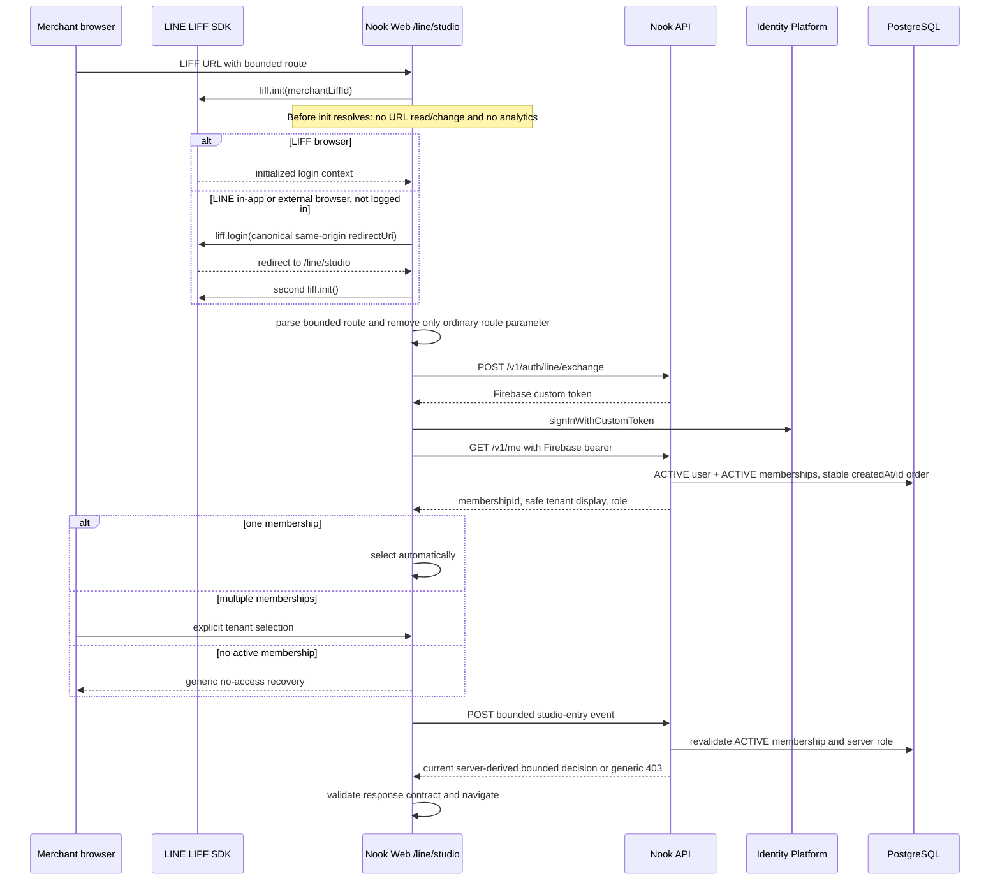

# Merchant LINE entry and RWD navigation

## Purpose

平台官方帳號只提供「快速回到店務工作台」的低摩擦入口，不承擔租戶選擇、角色授權或任何預約 mutation。此能力所有方案可用，目標是提高店家每週使用率並降低教學／客服成本；它不是可按點擊計費的功能，也不能取代 Phase 6 店家自有 OA automation。

## Canonical routes

Merchant LIFF Endpoint URL 固定為 `https://<web-origin>/line/studio`。Rich menu 使用 `https://liff.line.me/<merchantLiffId>/?route=<key>`，其中 key 只能是：

| key            | Studio surface         |
| -------------- | ---------------------- |
| `home`         | `/studio`              |
| `appointments` | `/studio/appointments` |
| `services`     | `/studio/services`     |
| `availability` | `/studio/staff`        |
| `portfolio`    | `/studio/portfolio`    |
| `policies`     | `/studio/policies`     |

映射由 `@nook/contracts` 的 `resolveStudioNavigation` 版本化，不建立 resolver API。Invalid、absolute URL、nested return URL或夾帶tenant/status的值一律解析為`home`。

## Authentication sequence

Primary redirect後每個tab只讀自己的完成-init URL；route不跨tab共享。`liff.*`、`lineAppVersion`與fragment不由Nook自行讀取、刪除或改寫。

## Role navigation

OWNER／MANAGER可進六個surface。VIEWER只進home與read-only appointments；STAFF只進home與server-scoped appointments。其他組合回`/studio`並顯示固定授權不足訊息。這只是UI導航：每個read/write API仍在application service或transaction repository重新驗證ACTIVE user、tenant、membership、role與STAFF scope。

Deep link不接受appointment ID、status、role、tenant或idempotency key。每個目標頁依既有contract重新GET current server truth；write操作仍顯示確認並送到原application service。

## Recovery and analytics

- 401：清除Firebase session並回登入。
- 403：先以`private, no-store`重讀`/v1/me`；只有selected tenant已不在ACTIVE memberships時才清除選擇並回安全tenant選擇。Role-denied但membership仍ACTIVE時保留tenant，不把不足權限誤判為撤銷。
- LIFF取消授權／init失敗／redirect failure：繁中說明與明確重試。
- `nook.studio.entryNotice`只存固定`role_fallback` code，讀取一次即刪除。
- Event request只含`tenantId`與route key；server從current membership推導`success|fallback`並回傳bounded `routeKey, href, access`，browser不使用較早的`/v1/me` role自行決定最終導向。Log allowlist為`requestId, operation=line.merchant_entry, outcome, routeKey, httpStatus`及授權後tenant ID。

## Commercial guardrail

平台OA營運入口不計訊息點數、不作為登入或營收conversion。可追蹤的產品指標是「authenticated entry → authorized Studio navigation」aggregate；不得把rich menu click等同活躍店家或付費意圖。店家自有OA、行銷群發與每tenant token custody仍屬Phase 6／NT$299 automation加購。
