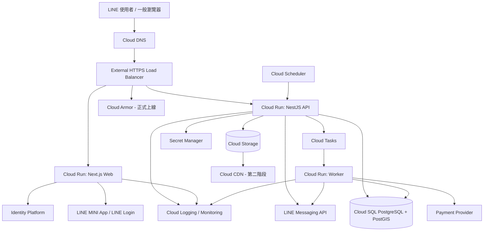
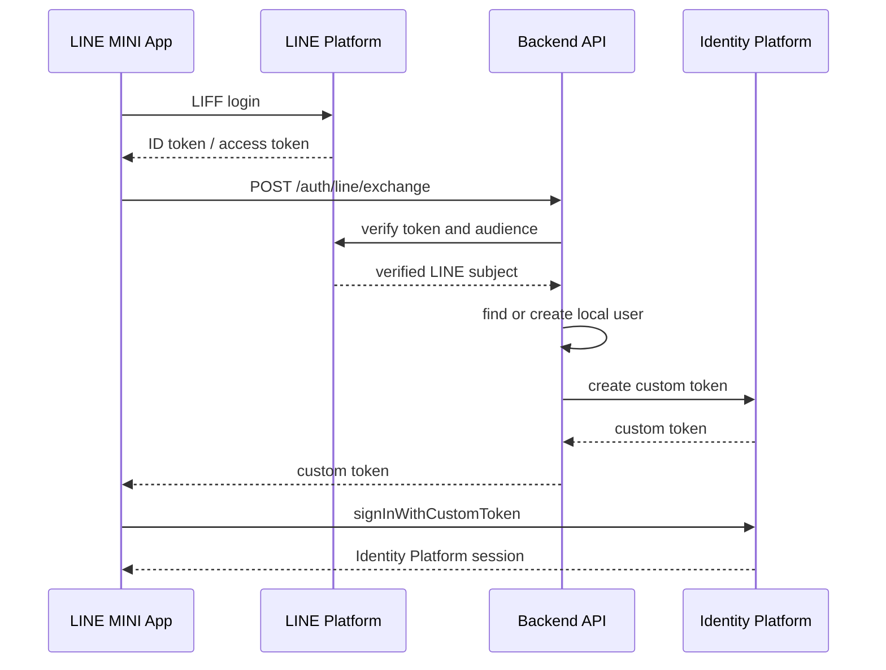

# LINE 美業預約與店務平台：商業模型暨 GCP 技術規劃

版本：v1.0  
定位：台灣一人工作室與小型美業店家的 LINE-first 店務 SaaS＋新客媒合平台  
預設地區與時區：台灣，Asia/Taipei  
建議首發垂直：美甲、美睫個人工作室

---

## 0. 核心決策摘要

### 產品定位

不是單純的「線上預約工具」，而是：

> 讓個人工作室在五分鐘內建立可被搜尋的店家頁面、作品集、服務與空檔，顧客不下載 App，直接在 LINE 完成搜尋、預約、提醒與評論；店家用同一後台管理班表、顧客與回訪。

### 商業策略

1. **先做店務 SaaS，再做媒合平台。**
2. 第一階段鎖定單一業種與單一都會區，先累積供給密度。
3. 店家自己帶來的顧客不抽成。
4. 平台搜尋帶來的首次新客才收成交費。
5. 月繳正式價不建議訂 300 元；建議個人版月繳 399 元、年繳折算每月 299 元。
6. 免費方案負責累積店家資料與作品，不負責提供完整店務能力。

### 技術策略

1. 全系統部署於 GCP 台灣區 `asia-east1`。
2. 採 **模組化單體 Modular Monolith**，不在 MVP 階段拆微服務。
3. 前端採 Next.js＋TypeScript，後端採 NestJS＋TypeScript。
4. 主資料庫採 Cloud SQL for PostgreSQL，啟用 PostGIS。
5. 執行環境採 Cloud Run，背景任務採 Cloud Tasks＋Cloud Scheduler。
6. 圖片採 Cloud Storage，前端直接使用 Signed URL 上傳。
7. 消費者登入採 LINE Login；後端驗證 LINE token 後換發 Identity Platform custom token。
8. 預約確認必須在 PostgreSQL transaction 中完成，避免重複預約。

---

# 1. 商業模型

## 1.1 目標客群

### 第一優先

- 一人美甲工作室
- 一人美睫工作室
- 紋繡工作室
- 個人美容師
- 獨立髮型設計師

### 第二優先

- 寵物美容
- 刺青與穿孔
- 按摩、SPA、芳療
- 健身教練、皮拉提斯、瑜伽私人課
- 汽車美容、鍍膜

### 暫不進入

- 醫療診所
- 心理治療
- 大型連鎖沙龍
- 需要複雜派工的到府服務
- 需要完整 POS、庫存、薪資與會計整合的企業客戶

---

## 1.2 收費方案

### 建議正式方案

| 功能 | 免費曝光版 | 個人版 | 專業版 | 工作室版 |
|---|---:|---:|---:|---:|
| 月繳價格 | NT$0 | NT$399 | NT$899 | NT$1,699 |
| 年繳價格 | NT$0 | NT$3,588 | NT$8,988 | NT$16,990 |
| 年繳月均 | NT$0 | NT$299 | NT$749 | 約 NT$1,416 |
| 適用對象 | 尚未數位化店家 | 一人工作室 | 2–3 人小店 | 4–8 人工作室 |
| 服務人員數 | 1 | 1 | 3 | 8 |
| 店家公開頁面 | 有 | 有 | 有 | 有 |
| 服務項目與價格 | 最多 5 項 | 不限 | 不限 | 不限 |
| 作品集 | 最多 20 張 | 300 張 | 1,000 張 | 3,000 張 |
| 每月線上預約 | 最多 20 筆 | 不限 | 不限 | 不限 |
| 顧客資料 | 基本名單 | 完整紀錄 | 完整紀錄 | 完整紀錄 |
| 顧客備註與標籤 | 無 | 基本 | 進階 | 進階 |
| 預約確認 | 有 | 有 | 有 | 有 |
| LINE 預約提醒 | 1 次 | 2 次 | 自訂規則 | 自訂規則 |
| 取消與改期 | 有 | 有 | 有 | 有 |
| 休假與例外班表 | 基本 | 有 | 有 | 有 |
| 服務前後緩衝時間 | 無 | 有 | 有 | 有 |
| 已驗證評論 | 有 | 有 | 有 | 有 |
| 定金與付款 | 無 | 加購 | 有 | 有 |
| 優惠券 | 無 | 無 | 有 | 有 |
| 會員分群 | 無 | 無 | 有 | 有 |
| 自動回訪提醒 | 無 | 基本 | 進階 | 進階 |
| 營運報表 | 無 | 基本 | 進階 | 進階＋員工別 |
| 員工權限 | 無 | 無 | 基本 | 完整 RBAC |
| CSV 匯出 | 店家資料 | 顧客與預約 | 全部 | 全部 |
| 自訂品牌色與網址 | 無 | 無 | 有 | 有 |
| 客服 | 說明中心 | Email | 優先 Email | 優先處理 |

### 加購項目

| 加購項目 | 建議價格 |
|---|---:|
| 額外服務人員 | NT$199／人／月 |
| 額外 1,000 張圖片空間 | NT$99／月 |
| 定金／金流模組 | NT$99／月＋金流商費用 |
| 進階 LINE 行銷自動化 | NT$299／月，不含 LINE OA 訊息費 |
| 資料匯入服務 | NT$1,500～5,000／次 |
| 專屬導入與教育 | NT$3,000 起 |
| 自訂網域 | NT$99／月，網域費另計 |

### 平台媒合收入

- 店家自行分享專屬連結、QR Code、Instagram、Google 或 LINE OA 帶入：**不抽成**。
- 顧客從平台的附近搜尋、作品搜尋或推薦頁第一次找到店家：
  - 首次完成服務收取 **8% 媒合費**。
  - 每筆上限 **NT$250**。
  - 同一顧客之後回訪不抽成。
- 媒合來源必須以 `acquisition_source` 與 attribution token 紀錄，避免爭議。

### 早期市場方案

- 前 100 家創始店家：個人版 12 個月 NT$2,388，續約恢復正式年費。
- 不提供永久低價，避免未來無法調價。
- 創始店家須完成：公開價格、至少 10 張作品、開放線上預約、每月提供一次訪談回饋。

---

## 1.3 為什麼不建議月繳 300 元

300 元可以是年繳後的有效月費，但不適合作為正式月繳唯一價格，原因包括：

- 金流、客服、簡訊或 LINE 訊息、圖片、備份與資安皆有變動成本。
- 一人工作室需要較多導入協助，客服成本往往高於雲端主機成本。
- 月費太低會限制業務獲客成本，無法投入消費者端流量。
- 未來調價容易造成反彈，因此一開始就應建立清楚的價值階梯。

### 建議目標

- 付費店家加權 ARPU：NT$600～750／月。
- SaaS 毛利率：長期目標 80% 以上。
- CAC 回收期：小於 6 個月。
- 月流失率：成熟後低於 2.5%。
- 自助完成 onboarding 比例：高於 70%。
- 每家每月人工客服時間：低於 20 分鐘。

### 1,000 家付費店家試算

假設方案組合：

- 個人版 55%
- 專業版 35%
- 工作室版 10%

月費加權 ARPU 約 NT$704，則：

- SaaS MRR：約 NT$704,000
- SaaS ARR：約 NT$8,448,000
- 尚未包含媒合費、金流加購與導入服務收入

因此產品不能只靠 NT$300 單一月費，否則即使有 1,000 家店家，仍很難支撐產品、客服與消費者行銷團隊。

---

# 2. 產品範圍

## 2.1 使用者角色

### Consumer 顧客

- LINE 登入
- 找附近店家
- 依服務、價格、作品、評價與空檔篩選
- 收藏店家或設計師
- 預約、取消、改期
- 支付定金
- 接收預約通知
- 完成服務後評論
- 查看自己的預約紀錄

### Owner 店主

- 建立店家與據點
- 管理方案與帳單
- 建立員工、服務、班表、規則
- 管理預約、顧客、會員標籤
- 管理作品與評論回覆
- 查看營運報表
- 設定取消、遲到、定金與隱私政策

### Staff 服務人員

- 查看自己的班表
- 新增與更新預約
- 查看授權範圍內的顧客資料
- 記錄服務備註
- 標記完成、未到、取消
- 上傳作品

### Platform Admin 平台管理員

- 店家審核與停權
- 作品檢舉與內容管理
- 評論爭議處理
- 方案與 entitlement 管理
- 客服 impersonation；必須有明顯提示與 audit log
- 媒合歸因與費用調整
- 系統營運儀表板

---

## 2.2 MVP 必做功能

### 店家 onboarding

1. LINE 登入。
2. 建立店家名稱、分類、電話、地址與地圖位置。
3. 建立至少一位服務人員。
4. 建立服務名稱、價格、時間長度與緩衝時間。
5. 設定每週營業時間與休假。
6. 上傳作品。
7. 預覽公開頁面。
8. 啟用線上預約。
9. 產生店家永久連結與 QR Code。

### 預約

- 顧客選擇店家、服務、服務人員與日期。
- 系統即時計算可用時段。
- 建立 10 分鐘 slot hold。
- 若需要定金，導向金流。
- 付款成功或免定金時確認預約。
- 傳送預約完成通知。
- 服務前 24 小時與 2 小時提醒。
- 顧客可依規則取消或改期。
- 店家可完成、取消、標記 no-show。

### 顧客 CRM

- 顧客基本資料
- LINE identity
- 歷史預約
- 消費金額
- 顧客來源
- 內部備註
- 標籤
- 最近到店日
- 建議回訪日
- no-show 次數

### 公開搜尋

- 依經緯度查附近店家
- 依服務分類
- 依關鍵字
- 依價格範圍
- 依近期可預約時間
- 依評分與評論數
- 依作品標籤

### 評論

- 只有 `completed` 預約可建立評論。
- 每筆預約只能建立一次評論。
- 評論分數 1～5 星，文字與圖片可選。
- 店家可公開回覆一次。
- 顧客可在限定期間修改。
- 檢舉後進入人工審查。

---

## 2.3 第二階段功能

- 定金與退款
- 候補名單
- 套票與堂數
- 優惠券
- 會員分群與自動回訪
- 店家自己的 LINE OA 串接
- Google 商家連結與導流追蹤
- 多服務組合預約
- 共用設備／房間資源
- 多據點
- 員工抽成與業績報表
- 媒合費結算
- 動態推薦排序

## 2.4 暫緩功能

- 完整 POS
- 庫存、進貨與供應商
- 薪資與勞健保
- 原生 iOS／Android App
- 即時聊天系統
- 直播
- 大型電商
- AI 自動生成美容建議
- 跨國多幣別

---

# 3. 系統架構

## 3.1 架構原則

- 模組化單體，模組間透過明確 service interface 與 domain event 溝通。
- API 與 worker 可分別部署，但共用同一 domain package 與 PostgreSQL。
- 所有外部 webhook 必須 idempotent。
- 所有方案限制使用 entitlement，而不是在程式內硬寫方案名稱。
- 所有店家資料表必須含 `tenant_id`。
- 所有重要異動必須寫入 audit log。
- 預約、付款與方案異動採狀態機，不允許任意改狀態。

## 3.2 GCP 架構圖



## 3.3 MVP GCP 資源

| GCP 服務 | 用途 | MVP 是否啟用 |
|---|---|---|
| Cloud Run | Web、API、Worker | 是 |
| Cloud SQL PostgreSQL | 交易資料、搜尋、地理查詢 | 是 |
| PostGIS | 附近店家與距離查詢 | 是 |
| Cloud Storage | 作品、頭像、評論圖片 | 是 |
| Cloud Tasks | 非同步通知、重試、webhook 後處理 | 是 |
| Cloud Scheduler | 定期派送到期提醒、日報與清理 | 是 |
| Identity Platform | LINE custom auth、員工登入 | 是 |
| Secret Manager | LINE、DB、金流密鑰 | 是 |
| Artifact Registry | Container image | 是 |
| Cloud Build 或 GitHub Actions | CI/CD | 是 |
| Cloud Logging / Monitoring | Log、metric、alert | 是 |
| Cloud DNS | 網域 | 是 |
| HTTPS Load Balancer | 路由、自訂網域、後續 CDN/Armor | 正式環境啟用 |
| Cloud Armor | WAF、rate limit、惡意流量防護 | 正式上線前啟用 |
| Memorystore Redis | 熱門搜尋、rate limit、短期 cache | 第二階段 |
| Pub/Sub | 跨模組事件流與分析事件 | 第二階段 |
| BigQuery | 行為分析與商業報表 | 第二階段 |

## 3.4 為什麼不用 Firestore 當主資料庫

預約系統需要：

- 跨多表 transaction
- 防止重複預約
- 複雜班表與可用時段查詢
- 會員、付款、方案、評論等關聯資料
- 地理距離查詢
- 報表與聚合

PostgreSQL 較適合做 system of record；Firestore 可在未來用於高流量即時狀態，但不應作為 MVP 主資料庫。

## 3.5 為什麼先不用微服務

- 預約、付款、顧客、方案彼此高度相關。
- 微服務會增加 distributed transaction、eventual consistency、部署與監控成本。
- 初期團隊小，開發速度比獨立擴展更重要。
- 模組化單體可在未來依負載拆出通知、搜尋、媒體與分析服務。

---

# 4. 建議技術棧

## 4.1 Monorepo

- pnpm workspace
- Turborepo
- TypeScript strict mode
- ESLint＋Prettier
- Changesets；若暫時沒有 package 發版需求可略過

## 4.2 應用程式

### `apps/web`

- Next.js
- React
- Tailwind CSS
- shadcn/ui 或自建 design system
- TanStack Query
- React Hook Form＋Zod
- LIFF SDK／LINE MINI App
- PWA 基礎能力；不把 PWA 當主要安裝策略

### `apps/api`

- NestJS
- REST API
- OpenAPI 3.1
- Zod 或 class-validator；全專案只選一種驗證策略
- Prisma ORM
- PostgreSQL transaction
- LINE SDK
- Payment adapter interface

### `apps/worker`

- NestJS standalone application
- Cloud Tasks HTTP handlers
- 通知派送
- 圖片 metadata 處理
- webhook 後處理
- 報表 aggregation

### `packages`

- `domain`：entity、value object、state machine、domain service
- `database`：Prisma schema、migration、repository
- `contracts`：API DTO、event schema、OpenAPI types
- `auth`：Identity Platform、LINE 驗證、RBAC
- `line`：LINE Login、Messaging API、service message adapter
- `payments`：支付抽象層
- `observability`：structured log、trace context
- `config`：typed environment config
- `ui`：共用元件

## 4.3 基礎設施

- Terraform 管理 GCP 資源。
- Docker multi-stage build。
- GitHub Actions 或 Cloud Build 執行測試與部署。
- Database migration 在部署流程以獨立 Cloud Run Job 執行。
- 不允許應用程式啟動時自動執行 migration。

---

# 5. 模組邊界

```text
Identity
Tenant & Membership
Merchant Profile
Location
Staff
Service Catalog
Availability
Booking
Customer CRM
Portfolio & Media
Review
Notification
LINE Integration
Payment
Subscription & Entitlement
Marketplace Search
Attribution
Admin & Moderation
Audit
Analytics Event
```

每一模組至少包含：

- controller／route
- application service
- domain logic
- repository interface
- infrastructure implementation
- DTO schema
- unit test
- integration test

禁止 controller 直接操作 Prisma client。

---

# 6. 核心資料模型

## 6.1 Identity 與租戶

### `users`

- `id`
- `display_name`
- `email`
- `phone`
- `avatar_url`
- `status`
- `created_at`
- `updated_at`

### `user_identities`

- `id`
- `user_id`
- `provider`：LINE、GOOGLE、EMAIL
- `provider_subject`
- `provider_tenant`
- `profile_json`
- unique `(provider, provider_subject)`

### `tenants`

- `id`
- `name`
- `slug`
- `status`
- `plan_id`
- `subscription_status`
- `created_at`

### `memberships`

- `tenant_id`
- `user_id`
- `role`：OWNER、MANAGER、STAFF、VIEWER
- `status`
- unique `(tenant_id, user_id)`

## 6.2 店家與地點

### `merchant_profiles`

- `tenant_id`
- `category`
- `description`
- `phone`
- `line_oa_url`
- `instagram_url`
- `booking_policy`
- `cancellation_policy`
- `visibility_status`
- `verification_status`

### `locations`

- `id`
- `tenant_id`
- `name`
- `address_text`
- `postal_code`
- `city`
- `district`
- `geo_point geography(Point, 4326)`
- `timezone`
- `is_public_address`
- `status`

地址可允許顧客預約前只看行政區，確認後才顯示完整地址，適合居家工作室。

## 6.3 服務人員與服務

### `staff_profiles`

- `id`
- `tenant_id`
- `user_id nullable`
- `location_id`
- `display_name`
- `bio`
- `booking_enabled`
- `sort_order`
- `status`

### `services`

- `id`
- `tenant_id`
- `category_id`
- `name`
- `description`
- `duration_minutes`
- `buffer_before_minutes`
- `buffer_after_minutes`
- `price_type`：FIXED、FROM、RANGE、QUOTE
- `price_amount`
- `price_min`
- `price_max`
- `deposit_rule_id`
- `booking_enabled`
- `status`

### `staff_services`

- `staff_id`
- `service_id`
- `custom_duration_minutes nullable`
- `custom_price nullable`
- unique `(staff_id, service_id)`

## 6.4 班表與可用時間

### `weekly_availability_rules`

- `id`
- `tenant_id`
- `staff_id`
- `weekday`
- `start_time`
- `end_time`
- `valid_from`
- `valid_until nullable`

### `availability_exceptions`

- `id`
- `tenant_id`
- `staff_id`
- `type`：TIME_OFF、EXTRA_HOURS、BLOCK
- `start_at`
- `end_at`
- `reason`

## 6.5 預約

### `appointments`

- `id`
- `tenant_id`
- `location_id`
- `customer_id`
- `staff_id`
- `status`
- `start_at`
- `end_at`
- `occupied_start_at`
- `occupied_end_at`
- `source`：MERCHANT_LINK、MARKETPLACE、ADMIN、STAFF、IMPORT
- `attribution_id nullable`
- `customer_note`
- `internal_note`
- `currency`
- `subtotal_amount`
- `deposit_amount`
- `total_amount`
- `payment_status`
- `cancelled_at`
- `cancelled_by`
- `cancellation_reason`
- `created_at`
- `updated_at`

### `appointment_items`

- `id`
- `appointment_id`
- `service_id`
- `service_name_snapshot`
- `duration_minutes_snapshot`
- `price_amount_snapshot`

### `appointment_status_history`

- `id`
- `appointment_id`
- `from_status`
- `to_status`
- `actor_user_id`
- `reason`
- `created_at`

### `booking_holds`

- `id`
- `tenant_id`
- `staff_id`
- `start_at`
- `end_at`
- `expires_at`
- `consumer_user_id`
- `status`

## 6.6 顧客 CRM

### `customers`

- `id`
- `tenant_id`
- `user_id nullable`
- `display_name`
- `phone_encrypted`
- `email_encrypted`
- `birthday nullable`
- `first_visit_at`
- `last_visit_at`
- `total_visits`
- `total_spent`
- `no_show_count`
- `source`
- `consent_status`

### `customer_notes`

- `id`
- `tenant_id`
- `customer_id`
- `author_user_id`
- `content_encrypted`
- `created_at`

### `customer_tags` 與 `customer_tag_links`

用於 VIP、新客、敏感肌、偏好風格、需預付定金等分類。敏感資料不可使用公開字串 tag，應另做受控欄位。

## 6.7 作品與媒體

### `media_assets`

- `id`
- `tenant_id`
- `owner_type`
- `owner_id`
- `bucket`
- `object_key`
- `mime_type`
- `byte_size`
- `width`
- `height`
- `status`：PENDING、READY、REJECTED、DELETED
- `checksum`

### `portfolio_items`

- `id`
- `tenant_id`
- `staff_id nullable`
- `title`
- `description`
- `service_id nullable`
- `published_at`
- `status`

### `portfolio_tags`

- 風格、顏色、長度、服務分類等搜尋標籤。

## 6.8 評論

### `reviews`

- `id`
- `tenant_id`
- `appointment_id`
- `consumer_user_id`
- `rating`
- `content`
- `status`：PUBLISHED、HIDDEN、UNDER_REVIEW、REMOVED
- `merchant_reply`
- `created_at`
- unique `(appointment_id)`

## 6.9 通知、LINE 與 webhook

### `notification_jobs`

- `id`
- `tenant_id`
- `appointment_id nullable`
- `channel`：LINE_SERVICE_MESSAGE、LINE_PUSH、EMAIL
- `template_key`
- `due_at`
- `status`
- `attempt_count`
- `last_error`
- `dedupe_key`

### `notification_deliveries`

- 實際送出結果、provider message id、response code、費用歸屬。

### `webhook_events`

- `provider`
- `event_id`
- `payload_json`
- `received_at`
- `processed_at`
- `status`
- unique `(provider, event_id)`

## 6.10 方案與 entitlement

### `plans`

- `id`
- `code`
- `name`
- `billing_period`
- `price_amount`

### `entitlements`

- `code`：MAX_STAFF、MAX_PORTFOLIO、DEPOSIT_ENABLED、ADVANCED_REPORT 等
- `value_type`

### `plan_entitlements`

- `plan_id`
- `entitlement_code`
- `value_json`

### `subscriptions`

- `tenant_id`
- `plan_id`
- `status`
- `current_period_start`
- `current_period_end`
- `cancel_at_period_end`

不要寫 `if plan === 'PRO'`；應統一呼叫 entitlement service。

## 6.11 稽核與可靠性

### `audit_logs`

- `tenant_id`
- `actor_user_id`
- `action`
- `resource_type`
- `resource_id`
- `before_json`
- `after_json`
- `ip_hash`
- `created_at`

### `idempotency_keys`

- `scope`
- `key`
- `request_hash`
- `response_status`
- `response_body`
- `expires_at`

### `outbox_events`

- domain event 先與交易一起寫入資料庫，再由 worker 發送，避免 DB 已成功但通知工作未建立。

---

# 7. 預約引擎設計

## 7.1 預約狀態機

```text
DRAFT
  -> HELD
  -> PENDING_PAYMENT
  -> CONFIRMED
  -> CHECKED_IN
  -> COMPLETED

HELD -> EXPIRED
PENDING_PAYMENT -> PAYMENT_FAILED
CONFIRMED -> CANCELLED
CONFIRMED -> NO_SHOW
CONFIRMED -> RESCHEDULED
COMPLETED -> REFUND_PENDING -> REFUNDED
```

每一個 transition 必須：

- 驗證目前狀態
- 驗證 actor 權限
- 寫 status history
- 發出 domain event
- 產生或取消通知
- 必要時更新付款與媒合費

## 7.2 可用時段計算

輸入：

- location
- service
- staff 或 any staff
- 日期範圍
- 店家時區

計算順序：

1. 讀取每週班表。
2. 套用休假、額外營業與 block。
3. 套用服務人員可提供的服務。
4. 計算服務時間＋前後 buffer。
5. 排除已確認預約、待付款預約與未過期 hold。
6. 套用最早可預約時間，例如至少提前兩小時。
7. 套用最遠可預約天數，例如 60 天。
8. 依 slot interval，例如每 15 分鐘產生候選時段。
9. 回傳顧客看到的服務起始時間，不顯示 buffer。

## 7.3 防止重複預約

只在前端檢查可用時段不夠，確認時必須再次驗證。

建議做法：

- `appointments` 儲存 `occupied_start_at` 與 `occupied_end_at`。
- 使用 PostgreSQL range type 與 exclusion constraint，限制同一 staff 的有效預約時間不可重疊。
- `CANCELLED`、`NO_SHOW` 等不占用狀態可透過 partial constraint 或獨立 occupancy table 處理。
- 建立預約時在 transaction 中：檢查 hold、寫 appointment、完成 hold、建立 outbox event。
- API 支援 `Idempotency-Key`，顧客重按不會產生兩筆預約。

## 7.4 改期

不要直接覆寫舊時間，應：

1. 建立新的 slot hold。
2. transaction 內驗證新時段。
3. 建立新 appointment 或 appointment revision。
4. 將舊預約標記 `RESCHEDULED`。
5. 連結 `rescheduled_from_id`。
6. 取消舊提醒並建立新提醒。

---

# 8. LINE 整合

## 8.1 LINE MINI App

顧客主要流程全部可在 LINE MINI App 中執行：

- 登入
- 搜尋
- 店家頁面
- 作品集
- 預約
- 預約管理
- 評論

同一套 Web 亦須支援外部瀏覽器，讓 Google、Instagram、Threads 與朋友分享連結可正常開啟。

## 8.2 登入流程



安全要求：

- 後端只接受 raw token，不接受前端自行傳來的 LINE user id 當身分證明。
- 驗證 issuer、audience／channel id、expiry 與 nonce。
- LINE webhook 在解析 body 前驗證 `x-line-signature`。
- LINE channel secret 與 access token 放 Secret Manager。

## 8.3 LINE 通知策略

### 可用 LINE MINI App service message 的情境

- 預約完成
- 付款結果
- 改期結果
- 取消結果
- 到店提醒

Service message 只能作為使用者操作的確認或回應，不能拿來做一般促銷。

### 行銷與回訪

- 店家自己的 LINE OA 行銷訊息費由店家負擔。
- 平台不可把 300／399 月費解讀為包含不限量 LINE 推播。
- 第一版將通知 provider 抽象化，支援：
  - LINE MINI App service message
  - LINE Messaging API
  - Email fallback

## 8.4 一個平台 OA 與店家 OA

### MVP

- 使用平台官方帳號＋平台 MINI App。
- 店家有自己的永久連結與 QR Code。
- 顧客加入平台 OA 後進入 MINI App。

### 第二階段

- 讓店家連接自己的 OA。
- 每店的 channel access token 加密保存。
- 每個 webhook destination 對應 tenant。
- 必須明確區分平台訊息與店家訊息的費用、同意與退訂。

---

# 9. API 規劃

## 9.1 規範

- Base path：`/v1`
- JSON 使用 camelCase。
- 時間一律 ISO 8601 UTC 儲存，回傳時附 timezone context。
- 金額一律 integer，單位為最小貨幣單位；台幣即元。
- 列表使用 cursor pagination。
- 寫入 API 接受 `Idempotency-Key`。
- 錯誤格式採 RFC 9457 Problem Details 風格。
- 每個 response 帶 `requestId`。

## 9.2 主要 endpoint

### Auth

```text
POST /v1/auth/line/exchange
POST /v1/auth/logout
GET  /v1/me
```

### Marketplace

```text
GET /v1/marketplace/merchants
GET /v1/marketplace/merchants/:slug
GET /v1/marketplace/merchants/:slug/availability
GET /v1/marketplace/search/suggestions
```

### Booking

```text
POST /v1/booking-holds
GET  /v1/booking-holds/:id
DELETE /v1/booking-holds/:id
POST /v1/appointments
GET  /v1/appointments/:id
POST /v1/appointments/:id/confirm
POST /v1/appointments/:id/cancel
POST /v1/appointments/:id/reschedule
POST /v1/appointments/:id/check-in
POST /v1/appointments/:id/complete
POST /v1/appointments/:id/no-show
```

### Merchant admin

```text
POST /v1/tenants
GET  /v1/tenants/:tenantId
PATCH /v1/tenants/:tenantId
GET  /v1/tenants/:tenantId/dashboard

GET/POST/PATCH /v1/tenants/:tenantId/locations
GET/POST/PATCH /v1/tenants/:tenantId/staff
GET/POST/PATCH /v1/tenants/:tenantId/services
GET/POST/PATCH /v1/tenants/:tenantId/availability-rules
GET/POST/PATCH /v1/tenants/:tenantId/availability-exceptions
GET              /v1/tenants/:tenantId/appointments
GET              /v1/tenants/:tenantId/customers
GET/PATCH        /v1/tenants/:tenantId/customers/:customerId
```

### Media

```text
POST /v1/media/upload-intents
POST /v1/media/:id/complete
DELETE /v1/media/:id
```

`upload-intents` 回傳 GCS Signed URL，瀏覽器直接上傳，不讓圖片經過 API container。

### Review

```text
POST /v1/appointments/:id/review
PATCH /v1/reviews/:id
POST /v1/reviews/:id/report
POST /v1/reviews/:id/reply
```

### LINE webhook

```text
POST /v1/webhooks/line/messaging
POST /v1/webhooks/line/payment
```

### Payment webhook

```text
POST /v1/webhooks/payments/:provider
```

---

# 10. 背景任務與通知

## 10.1 不直接把所有未來提醒排進 Cloud Tasks

資料庫是提醒工作的 system of record。

流程：

1. 預約確認時建立 `notification_jobs`，填入 `due_at`。
2. Cloud Scheduler 每分鐘呼叫 dispatcher。
3. dispatcher 使用 `FOR UPDATE SKIP LOCKED` 取得已到期工作。
4. 將工作推入 Cloud Tasks。
5. worker 實際送出 LINE 或 Email。
6. 成功則標記 delivered；失敗由 Cloud Tasks retry。
7. 超過 retry 次數進 dead-letter 狀態並告警。

這樣能處理幾個月後的預約，也方便取消或改期時更新提醒。

## 10.2 必須非同步的工作

- LINE 訊息派送
- Email
- webhook 後處理
- 圖片 metadata 與縮圖
- 評論通知
- 回訪日計算
- 日報與月報
- 媒合費計算
- 搜尋 ranking aggregation

---

# 11. 搜尋與推薦

## 11.1 MVP 搜尋

使用 PostgreSQL：

- PostGIS `ST_DWithin` 做附近搜尋。
- `pg_trgm` 做店名與關鍵字模糊搜尋。
- PostgreSQL full-text search 做服務描述與作品標籤。
- 查詢結果 cursor pagination。

排序分數可由以下項目組合：

```text
score =
  距離分數 * 0.25
+ 近期有空檔 * 0.20
+ 已驗證評論品質 * 0.20
+ 作品相關度 * 0.20
+ 店家資料完整度 * 0.10
+ 新店探索權重 * 0.05
```

不要只按付費方案排序，否則顧客搜尋品質會惡化。付費曝光應明確標示贊助，並限制占比。

## 11.2 何時需要獨立搜尋引擎

滿足任一條件再評估拆出搜尋：

- 公開店家超過 100,000 家。
- 作品超過 5,000,000 筆。
- 搜尋 P95 超過 500ms 且 PostgreSQL 優化後仍無法改善。
- 需要複雜同義詞、向量搜尋或個人化排序。

---

# 12. 安全與個資

## 12.1 資料分類

### 公開資料

- 店家名稱
- 公開地址或行政區
- 服務與價格
- 作品
- 公開評論

### 個人資料

- 姓名
- LINE user identity
- 電話
- Email
- 預約歷史

### 敏感營運資料

- 顧客內部備註
- no-show 紀錄
- 付款資訊與退款資訊
- 員工權限
- 店家營收

## 12.2 控制措施

- 傳輸全程 HTTPS。
- GCP 預設 at-rest encryption；敏感欄位再做 application-level encryption。
- Secret Manager 管理所有外部密鑰。
- Cloud Run service account 最小權限。
- 開發、測試、正式環境使用不同 GCP project。
- 正式資料不得複製到開發環境。
- PII 不得寫入 application log。
- Log 中的電話、Email、LINE subject 必須遮罩或 hash。
- Owner／staff 只能存取 membership 所屬 tenant。
- repository 層強制 tenant scope。
- 管理員 impersonation 必須記錄理由、時間與操作。
- 匯出顧客資料須二次驗證並寫 audit log。
- 提供顧客查詢、更正、刪除與停止利用流程。
- 設定資料保留政策：已取消帳號經法定或帳務保留期後刪除／匿名化。

## 12.3 API 防護

- Cloud Armor rate limiting。
- Auth endpoint、搜尋 endpoint 與 webhook endpoint 分別設計 rate limit。
- LINE webhook 驗簽後才解析與處理。
- Payment webhook 驗簽並保存原始 payload。
- CORS allowlist。
- CSRF protection；若使用 cookie session。
- CSP、HSTS、X-Content-Type-Options。
- Signed URL 限制 MIME、檔案大小、object prefix 與有效時間。
- 上傳後由 worker 驗證實際 MIME 與圖片內容。

---

# 13. DevOps 與環境

## 13.1 GCP project

```text
beauty-platform-dev
beauty-platform-stg
beauty-platform-prod
```

正式資料與測試資料完全分開。

## 13.2 Branch 與部署

- `main`：正式可部署版本。
- pull request：lint、typecheck、unit test、integration test、build。
- merge main：自動部署 staging。
- production：使用 GitHub Environment approval 或 Cloud Deploy 手動批准。

## 13.3 CI pipeline

1. Install dependencies with lockfile。
2. Lint。
3. Typecheck。
4. Unit tests。
5. Integration tests with ephemeral PostgreSQL。
6. Build apps。
7. Build container images。
8. Dependency and container vulnerability scan。
9. Push Artifact Registry。
10. Deploy staging。
11. Run smoke tests。
12. Approval。
13. Run backward-compatible migration job。
14. Deploy production with traffic split。
15. Run production smoke tests。

## 13.4 Migration 原則

採 expand-and-contract：

1. 先新增 nullable column／new table。
2. 部署同時支援新舊 schema 的程式。
3. background backfill。
4. 切換讀取邏輯。
5. 最後移除舊欄位。

禁止將 destructive migration 與依賴它的新程式一次部署。

---

# 14. 測試策略

## Unit test

- 預約狀態機
- 價格與定金計算
- entitlement 判斷
- 取消政策
- 可用時段計算
- attribution 判斷

## Integration test

- PostgreSQL exclusion constraint
- transaction rollback
- repository tenant isolation
- webhook idempotency
- outbox dispatch
- notification retry

## Contract test

- LINE token verification adapter
- LINE webhook signature
- Payment provider webhook
- Signed URL upload flow

## End-to-end test

- 顧客首次登入到完成預約
- 免定金預約
- 需定金預約
- 重複點擊確認
- 同時兩人搶同一時段
- 取消與改期
- 店家完成服務後顧客評論
- 方案降級後 entitlement 生效

### MVP 上線門檻

- 核心 domain unit test coverage 80% 以上。
- 一般模組不強求整體 coverage 數字，但關鍵流程必須 E2E。
- 兩個 concurrent booking request 只能成功一個。
- webhook 重送不產生重複付款、預約或通知。

---

# 15. 監控、SLO 與告警

## 15.1 SLO

### MVP

- 月可用性：99.5%
- API P95：一般讀取小於 500ms
- Availability query P95：小於 800ms
- Booking confirmation P95：小於 1.5s，不含外部付款頁
- Reminder delivery：預定時間前後 5 分鐘內 99%
- RPO：24 小時以下
- RTO：4 小時以下

### 成長期

- 月可用性：99.9%
- RPO：15 分鐘以下
- RTO：1 小時以下

## 15.2 重要 metric

- request count／error rate／latency
- Cloud Run instance count／cold start
- DB connection usage／CPU／storage／slow query
- booking creation success rate
- slot conflict count
- payment webhook delay
- notification success rate
- webhook retry count
- active tenants
- booking per tenant
- onboarding completion funnel

## 15.3 必須告警

- 5xx rate > 2% 持續 5 分鐘
- booking API error > 1%
- DB connection > 80%
- Cloud SQL storage > 75%
- notification queue delay > 10 分鐘
- payment webhook processing failure
- LINE webhook signature failure異常增加
- backup failure

---

# 16. 備份與災難復原

- Cloud SQL 啟用 automated backup 與 point-in-time recovery。
- 正式環境啟用 high availability 的時間點：開始處理真實金流前，或付費店家超過 100 家前。
- Cloud Storage 使用 object versioning 或 soft delete；依成本設定保留天數。
- Terraform state 使用獨立受保護 bucket。
- 每季執行一次 restore drill。
- 備份成功不等於可復原；必須實際還原到隔離環境驗證。

---

# 17. GCP 成本規劃

以下為規劃區間，不是報價；實際費用依 Cloud SQL 規格、流量、圖片下載、HA、備份、LINE 訊息與金流而變動。

## 開發期

- Cloud Run scale to zero
- 小型 Cloud SQL，非 HA
- 少量 GCS
- 預估：NT$1,500～4,000／月

## 封閉 Beta：20～100 家店

- Cloud Run Web／API／Worker
- Cloud SQL 小型正式 instance
- 自動備份
- Storage 與 Tasks
- 預估：NT$4,000～12,000／月

## 早期正式：100～1,000 家店

- Cloud SQL HA
- Load Balancer＋Cloud Armor
- Cloud CDN
- 監控與較長 log retention
- 預估：NT$15,000～60,000／月

## 成長期

主要成本通常依序是：

1. Cloud SQL CPU、RAM、HA 與儲存。
2. 圖片對外流量。
3. LINE OA 或 Email 訊息。
4. 支付手續費。
5. 人工客服；通常比純雲端成本更需要控制。

成本優化：

- Cloud Run、Cloud SQL、Storage 放同一 region。
- 圖片由 GCS／CDN 提供，不經 API。
- 產生 WebP／AVIF 縮圖，限制原圖大小。
- Cloud Run 設 max instances，避免流量異常拖垮 DB。
- DB connection pool 必須依 Cloud Run 最大 instance 數計算。
- MVP 不開常駐 Redis，確定有需求後再上。

---

# 18. 開發里程碑

## Phase 0：產品驗證與設計基線

交付：

- 30 家店訪談
- 10 家願意付費或簽署 beta 承諾
- 核心 user flow
- 資料字典
- wireframe
- cancellation／privacy／review policy 草案
- LINE MINI App channel 與 OA 申請

## Phase 1：平台骨架

交付：

- Monorepo
- Terraform
- Dev／staging／prod project
- Cloud Run 部署
- Cloud SQL migration
- Identity Platform
- LINE Login exchange
- tenant、membership、RBAC
- structured logging
- CI/CD

## Phase 2：店家 onboarding

交付：

- 店家、地點、服務人員、服務
- 班表與休假
- 作品上傳
- 公開店家頁
- 店家永久連結與 QR Code
- 方案 entitlement

## Phase 3：預約核心

交付：

- availability engine
- booking hold
- appointment state machine
- transaction／constraint 防撞單
- 店家日曆
- 顧客預約列表
- 取消與改期
- reminder jobs

## Phase 4：CRM、評論與搜尋

交付：

- 顧客資料與備註
- completed appointment review
- 附近店家
- 作品與服務搜尋
- 收藏
- 平台 admin moderation

## Phase 5：付費與正式 Beta

交付：

- SaaS subscription
- invoice／receipt reference
- 定金 provider adapter
- webhook idempotency
- 媒合 attribution
- Cloud Armor
- HA／PITR
- SLO dashboard
- 20～50 家真實 beta 店家

## Phase 6：成長功能

- 店家 OA 串接
- 優惠券、會員分群、回訪提醒
- 媒合費結算
- 多員工與多據點
- BigQuery analytics
- 推薦排序

---

# 19. Repository 結構

```text
beauty-platform/
├─ apps/
│  ├─ web/
│  ├─ api/
│  └─ worker/
├─ packages/
│  ├─ domain/
│  ├─ database/
│  ├─ contracts/
│  ├─ auth/
│  ├─ line/
│  ├─ payments/
│  ├─ observability/
│  ├─ config/
│  └─ ui/
├─ infra/
│  ├─ terraform/
│  │  ├─ modules/
│  │  └─ environments/
│  │     ├─ dev/
│  │     ├─ stg/
│  │     └─ prod/
│  └─ docker/
├─ docs/
│  ├─ adr/
│  ├─ api/
│  ├─ product/
│  ├─ runbooks/
│  └─ security/
├─ tests/
│  ├─ e2e/
│  └─ fixtures/
├─ .github/workflows/
├─ docker-compose.yml
├─ pnpm-workspace.yaml
├─ turbo.json
└─ README.md
```

---

# 20. Codex 開發規則

在 repository 根目錄建立 `AGENTS.md`：

```md
# Engineering Rules

- Use Traditional Chinese for user-facing copy and English for code identifiers.
- Use TypeScript strict mode. Do not use `any` without an explicit comment.
- Controllers must not access Prisma directly.
- Every tenant-owned query must require tenantId.
- All write APIs must validate authorization in the application service.
- Appointment status changes must use the domain state machine.
- Booking confirmation must run in a PostgreSQL transaction.
- External webhook handlers must be idempotent and store the raw event.
- Never log PII, tokens, secrets, payment payloads, or customer notes.
- Add unit tests for domain logic and integration tests for database constraints.
- Update OpenAPI and ADRs when changing a public contract or architecture decision.
- Do not add a GCP service or third-party dependency without an ADR.
- Migrations must be backward compatible.
- Run lint, typecheck, tests, and build before completing a task.
```

## 建議第一個 Codex 任務

```text
Read docs/product/business-technical-plan.md and AGENTS.md.
Create the initial pnpm/Turborepo monorepo with apps/web, apps/api, apps/worker,
and packages/domain, database, contracts, config, observability.

Use TypeScript strict mode. Add local Docker Compose PostgreSQL with PostGIS.
Create health endpoints for web, api, and worker. Add Prisma with an initial
User, UserIdentity, Tenant, Membership, AuditLog schema. Add lint, typecheck,
unit test, integration test, and build scripts. Add GitHub Actions CI.

Do not implement booking yet. Produce an ADR explaining the modular monolith,
Cloud Run deployment model, PostgreSQL choice, and tenant isolation strategy.
Run all checks and report changed files and remaining decisions.
```

## 後續 Codex 任務拆分原則

每個任務只做一個可驗收垂直切片，例如：

- LINE login exchange
- tenant onboarding
- service CRUD
- weekly availability
- booking hold
- booking confirmation conflict protection
- notification dispatcher
- verified review

每一任務必須包含：

1. schema／migration
2. domain logic
3. API contract
4. authorization
5. tests
6. observability
7. documentation

不要下「把整個預約系統做完」這類過大的 prompt。

---

# 21. MVP 驗收標準

## 店家端

- 新店家可在 10 分鐘內完成基本設定並開始接受預約。
- 店家可在手機上完成 90% 日常操作。
- 一人工作室不需要閱讀說明即可建立服務與班表。
- 店家可清楚知道預約來源。

## 顧客端

- 不下載 App。
- LINE 登入後三步內開始選時段。
- 一般預約流程在兩分鐘內完成。
- 可以明確看到價格、時間、取消政策與地址揭露規則。

## 系統端

- 相同服務人員、相同時間不可產生兩筆有效預約。
- 重送 webhook 不產生重複紀錄。
- 改期後舊提醒不會送出。
- 只有完成服務者能評論。
- 免費方案超過限制時顯示升級提示，不破壞既有資料。
- Tenant A 永遠無法讀取 Tenant B 的資料。

---

# 22. 主要風險與應對

| 風險 | 應對方式 |
|---|---|
| 店家不願維護資料 | onboarding 精簡、資料完整度提示、定期提醒、代建付費服務 |
| 平台沒有消費者流量 | 先提供 SaaS 價值，店家自帶流量也能使用 |
| 附近搜尋店家太少 | 先攻單一城市＋單一業種，不全台同時推 |
| 月費太低 | 399 月繳、299 年繳月均、專業方案與媒合收入 |
| LINE 平台依賴 | Web 支援外部瀏覽器、保留 email identity、domain logic 不綁 LINE |
| 重複預約 | DB exclusion constraint＋transaction＋idempotency |
| LINE 訊息成本失控 | 區分 service message、OA 行銷訊息與 Email；費用不全包 |
| 假評論 | 只允許 completed appointment 評論 |
| 居家工作室地址安全 | 預約前只顯示行政區，確認後再揭露完整地址 |
| 客服成本過高 | 自助 onboarding、模板、CSV 匯入收費、方案分級客服 |
| 雲端成本失控 | Cloud Run max instance、圖片直傳、CDN、預算告警 |
| 技術過度設計 | MVP 禁止微服務、Redis、BigQuery 與複雜事件平台 |

---

# 23. 最重要的商業 KPI

## 供給

- 新增店家數
- onboarding 完成率
- 公開可預約店家數
- 每店作品數
- 每區域可用店家密度

## 使用

- 每店每週登入
- 每店每月預約數
- 線上預約占總預約比例
- 顧客預約完成率
- 改期／取消／no-show 率

## 商業

- Free-to-paid conversion
- MRR／ARR
- ARPU
- 月 churn
- CAC 與 payback period
- 媒合新客 GMV
- 新客首次媒合後回訪率

## 品質

- 搜尋到預約 conversion
- Availability 查詢 latency
- Booking error rate
- Reminder delivery rate
- 客服工單／店家
- 評論爭議率

---

# 24. 執行優先順序

真正的最小成功路徑是：

1. 店家建立資料。
2. 店家建立服務與班表。
3. 店家分享自己的 LINE 預約連結。
4. 顧客完成預約。
5. 店家在後台看到預約與顧客。
6. 系統自動提醒。
7. 店家完成服務。
8. 顧客留下已驗證評論。
9. 這些店家資料與評論開始支撐公開搜尋。

第一版不應以「附近搜尋很漂亮」作為完成標準；應以「店家願意把真實預約搬進系統，並在一個月後繼續付費」作為完成標準。

---

# 25. 最終建議

建議採用以下市場與產品組合：

- 首發：台北／新北某一密集區域的美甲與美睫個人工作室。
- 商業模式：免費曝光＋399 個人 SaaS＋899 專業版＋首次新客 8% 媒合費。
- 技術：Next.js、NestJS、PostgreSQL/PostGIS、Cloud Run、Cloud SQL、Cloud Tasks、Cloud Storage、Identity Platform。
- 架構：模組化單體，三個部署單位 Web／API／Worker。
- 開發順序：身分與租戶 → 店家設定 → 班表 → 預約防撞 → 通知 → CRM → 評論 → 搜尋 → 付款。
- 成功判斷：至少 20 家真實店家、10 家付費、連續兩個月使用，且每家每月透過系統產生 10 筆以上真實預約。

